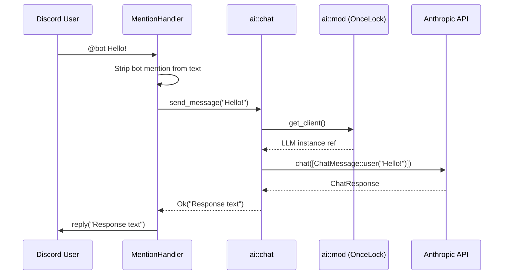

# AI Chat Service via Anthropic API

## Overview

Add an AI chat service to Dotacord that allows users to chat with Claude Sonnet by @mentioning the
bot. When a user mentions the bot in a Discord message, the mention handler strips the bot ping,
sends the remaining text to the Anthropic API via the `llm` crate, and replies with the AI response.
All AI logic lives in `src/ai/`. The Anthropic API key, model, and max tokens are configured via a
new `[anthropic]` config section following the same `api_key_var` pattern as the Discord token.

## Diagram



## Example Usage

```rust
// src/ai/mod.rs - initialization (follows database_access.rs OnceLock pattern)
static LLM_CLIENT: OnceLock<Box<dyn LLMProvider>> = OnceLock::new();

pub fn init_client(config: &AnthropicConfig) -> Result<(), Error> {
    let llm = LLMBuilder::new()
        .backend(LLMBackend::Anthropic)
        .api_key(&config.api_key)
        .model(&config.model)
        .max_tokens(config.max_tokens)
        .build()?;
    // store in OnceLock...
}

pub fn get_client() -> Result<&'static Box<dyn LLMProvider>, Error> { ... }
```

```rust
// src/ai/chat.rs - message sending
pub async fn send_message(user_text: &str) -> Result<String, Error> {
    let client = super::get_client()?;
    let messages = vec![
        ChatMessage::user().content(user_text).build(),
    ];
    let response = client.chat(&messages).await?;
    response.text().ok_or_else(|| "No text in AI response".into())
}
```

```rust
// src/discord/mention_handler.rs - updated dispatch
let mentioned = new_message.mentions_me(&ctx).await.unwrap_or(false);
if mentioned {
    let text = strip_mention(&new_message.content);
    match crate::ai::chat::send_message(&text).await {
        Ok(response) => { new_message.reply(&ctx.http, &response).await?; }
        Err(e) => { tracing::error!("AI chat error: {:?}", e); }
    }
}
```

## Flow

1. **Startup**: `config::load_config()` reads `[anthropic]` section →
   `ai::init_client(&cfg.anthropic)` stores LLM client in `OnceLock`
2. **Runtime**: `MentionHandler::dispatch` detects bot mention → strips mention text → calls
   `ai::chat::send_message()` → replies with result
3. **Error path**: AI failures are logged via `tracing::error!`, user sees nothing (no crash, no
   error reply)

## Implementation Steps

### Step 1: Add `llm` dependency

**File**: `Cargo.toml`

Add to `[dependencies]`:

```toml
llm = { version = "1.3", features = ["anthropic"] }
```

### Step 2: Add `[anthropic]` config section

**Files**: `dotacord.debug.toml`, `dotacord.release.toml`

Add at the end of each file:

```toml
[anthropic]
api_key_var = "KEY_ANTHROPIC"
model = "claude-sonnet-4-20250514"
max_tokens = 1024
```

### Step 3: Update config structs and loading

**File**: `src/config.rs`

3a. Add a new deserialization struct (matching the existing `FileLogConfig` pattern of private
structs):

```rust
#[derive(Debug, Deserialize, Clone)]
struct FileAnthropicConfig {
    pub api_key_var: String,
    pub model: String,
    pub max_tokens: u32,
}
```

3b. Add `anthropic: FileAnthropicConfig` field to `FileConfig` (line ~10-25, alongside other fields
like `log`, `scheduler`).

3c. Add a public `AnthropicConfig` struct (the resolved config, like `LogConfig` is to
`FileLogConfig`):

```rust
#[derive(Clone, Debug)]
pub struct AnthropicConfig {
    pub api_key: String,
    pub model: String,
    pub max_tokens: u32,
}
```

3d. Add `pub anthropic: AnthropicConfig` field to `AppConfig` (line ~86-99).

3e. In `load_config()`, resolve the key the same way as Discord's key. Currently `api_key_var` is
copied directly as the string value (env var lookup is commented out at line ~138-143). Follow the
same pattern:

```rust
let anthropic = AnthropicConfig {
    api_key: cfg.anthropic.api_key_var,
    model: cfg.anthropic.model,
    max_tokens: cfg.anthropic.max_tokens,
};
```

Add `anthropic` to the `Ok(AppConfig { ... })` block (around line ~147).

### Step 4: Create `src/ai/mod.rs`

**File**: `src/ai/mod.rs` (new file)

Follow the `src/database/database_access.rs` OnceLock pattern exactly:

- `use std::sync::OnceLock;`
- `use llm::builder::{LLMBackend, LLMBuilder};`
- `use llm::LLMProvider;`
- `use crate::Error;`
- `static LLM_CLIENT: OnceLock<Box<dyn LLMProvider>>` — stores the built client
- `pub fn init_client(config: &crate::config::AnthropicConfig) -> Result<(), Error>` — builds with
  `LLMBuilder::new().backend(LLMBackend::Anthropic).api_key(&config.api_key).model(&config.model).max_tokens(config.max_tokens).build()?`,
  stores via `.set()` with the same error mapping pattern as `database_access.rs`
- `pub fn get_client() -> Result<&'static Box<dyn LLMProvider>, Error>` — `.get().ok_or_else(...)`
  with same error style
- `pub mod chat;`
- Add `use tracing::info;` and log `"AI client initialized"` on success

**Note**: The exact concrete type from `LLMBuilder::build()` needs to be verified at implementation
time. If it returns a concrete type rather than `Box<dyn LLMProvider>`, adjust the `OnceLock` type
accordingly.

### Step 5: Create `src/ai/chat.rs`

**File**: `src/ai/chat.rs` (new file)

Single public async function:

```rust
use llm::chat::ChatMessage;
use crate::Error;

#[tracing::instrument(level = "trace", skip(user_text))]
pub async fn send_message(user_text: &str) -> Result<String, Error> {
    let client = super::get_client()?;
    let messages = vec![
        ChatMessage::user().content(user_text).build(),
    ];
    let response = client.chat(&messages).await?;
    response.text()
        .map(|t| t.to_string())
        .ok_or_else(|| "No text in AI response".into())
}
```

### Step 6: Register `ai` module and init at startup

**File**: `src/main.rs`

6a. Add `mod ai;` to module declarations (line ~1-9, alongside the other `mod` statements).

6b. Call `ai::init_client(&cfg.anthropic)?;` in the startup sequence after
`database_access::init_database()` (line ~62), before command registration:

```rust
database_access::init_database(&cfg.database_path).await?;
ai::init_client(&cfg.anthropic)?;
```

### Step 7: Update mention handler

**File**: `src/discord/mention_handler.rs`

7a. Add a helper function to strip bot mentions from message content. The mention format is
`<@BOT_ID>` or `<@!BOT_ID>`:

```rust
fn strip_mentions(content: &str) -> String {
    let mut result = content.to_string();
    while let Some(start) = result.find("<@") {
        if let Some(end) = result[start..].find('>') {
            result = format!("{}{}", &result[..start], &result[start + end + 1..]);
        } else {
            break;
        }
    }
    result.trim().to_string()
}
```

7b. Replace the current `"Hello World!"` reply (line 16) with the AI service call:

```rust
let text = strip_mentions(&new_message.content);
if text.is_empty() {
    return;
}
match crate::ai::chat::send_message(&text).await {
    Ok(response) => {
        if let Err(e) = new_message.reply(&ctx.http, &response).await {
            tracing::error!("Failed to reply with AI response: {:?}", e);
        }
    }
    Err(e) => {
        tracing::error!("AI chat error: {:?}", e);
    }
}
```

Keep the existing error handling style — log errors, never crash the handler.
