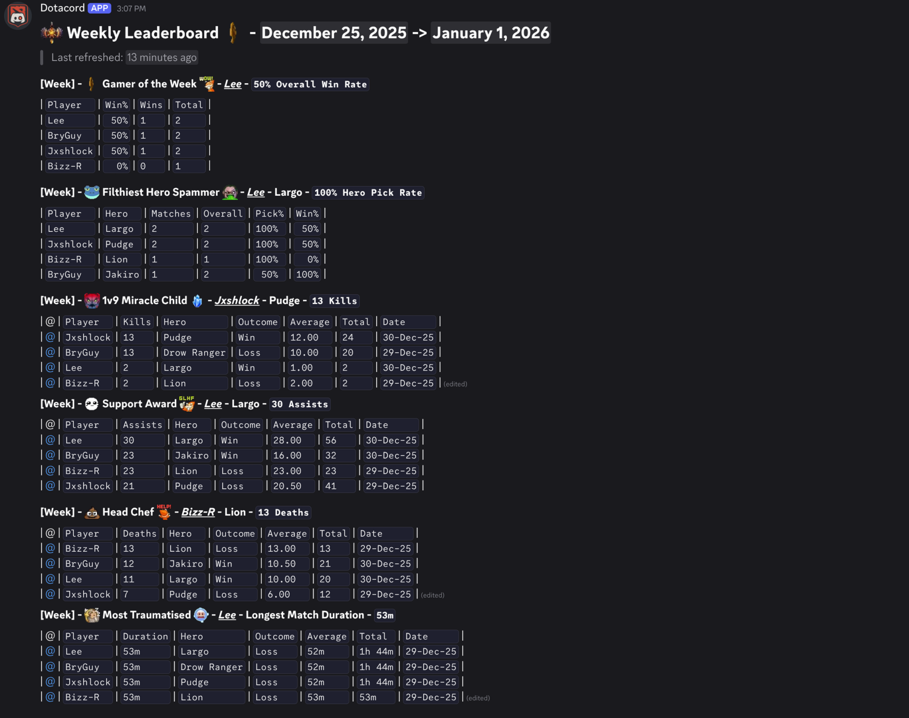
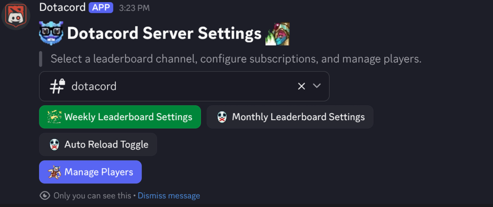

# Dotacord

A Discord bot for calculating and displaying a leaderboard of Dota players registered to the current server.

Uses the [OpenDota API](https://docs.opendota.com/) to fetch player statistics and match history and formats into multiple leaderboard sections for a specified time period.

## Commands

### User Commands

#### `/register_to_leaderboard <Dota Player ID>`

This allows a user to register themselves to the leaderboard by providing their Dota Player ID.

#### `/leaderboard <Duration>`

Generates and displays the leaderboard for the specified duration.

- Daily
- Weekly
- Monthly
- Yearly
- All Time

#### `/refresh_matches`

This refreshes the user's match history from the OpenDota API with their latest matches.

### Admin Commands

#### `/refresh_server_matches`

This forces a refresh of all registered players' match history from the OpenDota API.

#### `/admin_panel`

This opens an interactive admin panel to manage server settings, players, and leaderboard schedules.

## Leaderboard Sections

These sections will be displayed in a formated grid, either published to the registered channel, or as a private(ephemeral) response.

### Overall Stats

* Overall Win Rate
* Ranked Win Rate
* Hero Spam Rate

### Single Match Stats

* Most Kills
* Most Deaths
* Most Assists
* Longest Match

