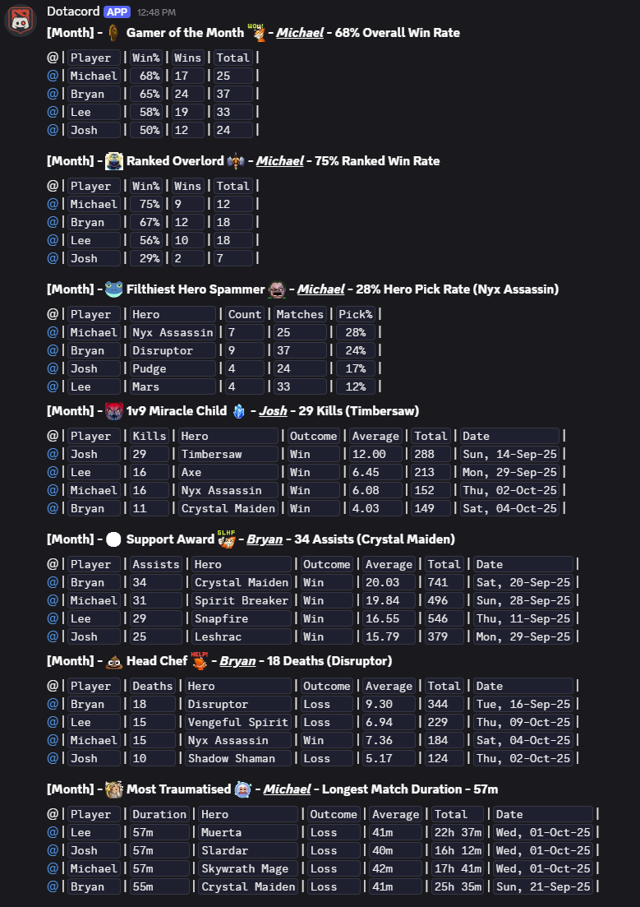

# Dotacord

A Discord bot for calculating and displaying a leaderboard of Dota players registered to the current server.

Uses the [OpenDota API](https://docs.opendota.com/) to fetch player statistics and match history and formats into multiple leaderboard sections for a specified time period.

## Sections

These sections will be displayed in a formated grid, either published to the registered channel, or as a private(ephemeral) response.

### Overall Stats

* Overall Win Rate
* Ranked Win Rate
* Hero Spam Rate

### Single Match Stats

* Most Kills
* Most Deaths
* Most Assists
* Longest Match

## Commands

### Public Commands

#### `/register_to_leaderboard <player_id>`

Allows a player to register themselves to the leaderboard by providing their Dota Player ID.
This command should be configured to be usable/restricted by anyone.

#### `/reload_matches`

Allows a user to to reload their own matches from the API. This should be on a cooldown timer to prevent API spam.

#### `/leaderboard [duration]`

Responds with an ephemeral leaderboard for the specified duration.

### Admin Commands

#### `/reload_server_matches`

Forces a reload of API matches for all players on the current server.

#### `/server_settings`

Opens an interactive settings panel to configure subscription channel, enable/disable weekly/monthly leaderboards and auto-reload, and set custom schedules per server.

#### `/players`

Opens an interactive panel to manage players on the current server. Allows adding, removing, renaming players, and changing their linked Dota ID or Discord user.

### Owner Commands

#### `/register_server <server_id>`

